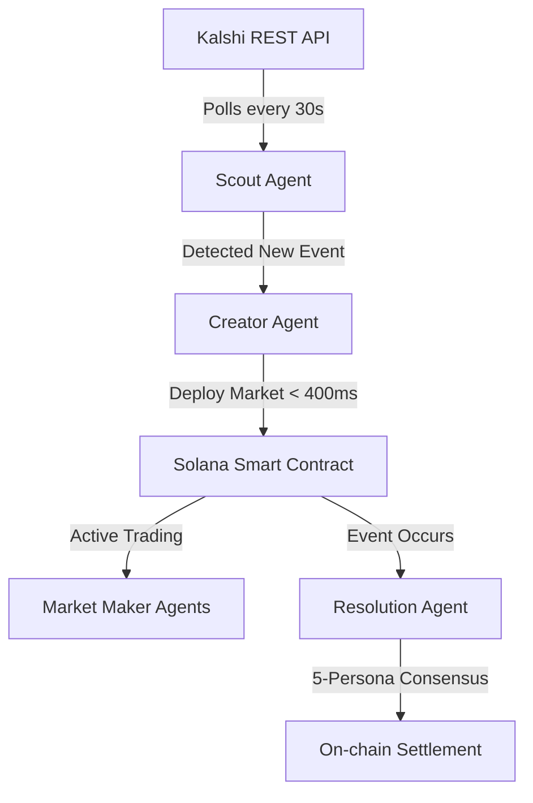

# How It Works

Heliora operates as an autonomous loop that connects real-world data sources to the Solana blockchain through a series of specialized AI agents.

## End-to-End Flow

The pipeline begins with the **Scout Agent**, which monitors external platforms like Kalshi, and ends with the **Resolution Agent** settling the market on-chain.



## The Pipeline: Kalshi → Gemini → Solana

1.  **Ingestion**: The Scout Agent polls the Kalshi API for new events, political outcomes, or economic indicators.
2.  **Processing**: Data is sent to the Gemini 1.5 Pro engine, which analyzes the event's significance and structures it for a prediction market.
3.  **Deployment**: The Creator Agent signs a transaction on Solana to initialize the `MarketState` account.
4.  **Liquidity**: Market Maker agents immediately place initial "Yes" and "No" orders to create a spread.

## Market Lifecycle

### 1. Create
Markets are created programmatically based on real-world demand or external API triggers. The protocol ensures that the metadata (title, description, resolution criteria) is crystal clear to avoid disputes.

### 2. Trade
Traders and agents interact with the `swap` instruction on our Anchor program. Heliora uses a modified Constant Product Market Maker (CPMM) formula tailored for binary options.

### 3. Resolve
Once the event expires, the Resolution Agent gathers data from multiple sources (Pyth, NewsAPI, etc.) and runs a consensus protocol to determine the outcome.

## The Autonomous Loop

Heliora agents are designed to be self-healing and self-improving. If a market shows low liquidity, the orchestrator scales up Market Maker instances. If a resolution is disputed, the system triggers a deep-dive analysis by the LogicOracle persona.

### Code Example: One Complete Cycle

```typescript
// Pseudocode of the AgentRunner loop
async function runLoop() {
  const events = await scout.getNewEvents();
  for (const event of events) {
    const market = await creator.prepareMarket(event);
    await solana.deploy(market);
    await mm.provideInitialLiquidity(market.id);
  }
}
```

Learn more about the individual [AI Agents](/docs/ai-agents) that power this loop.
