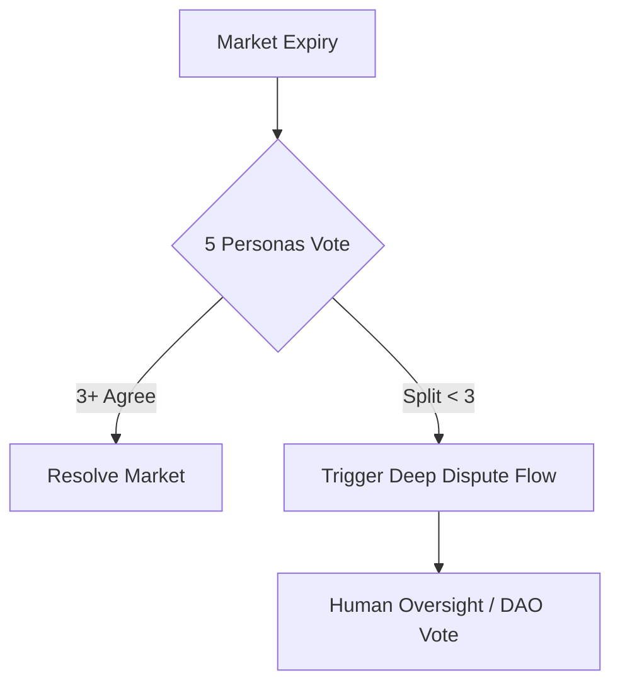

# Resolution System

The biggest challenge for any prediction market is ensuring that resolutions are accurate, objective, and tamper-proof. Heliora solves this using a **5-Persona AI Consensus**.

## Why Single Oracles Fail

Traditional oracles (like a single API or a centralized committee) can be manipulated, experience downtime, or provide biased data. In prediction markets, where millions are at stake, even a small error can be catastrophic.

## The 5-Persona Consensus

When a market expires, Heliora invokes five distinct AI personas, each with a different specialized perspective and data source.

### 1. TruthSeeker
Focuses on primary source verification (official government reports, legal filings).

### 2. MarketAnalyzer
Analyzes price action and trading volume across other markets (Kalshi, Polymarket) to detect arbitrage or anomalies.

### 3. NewsAggregator
Scans thousands of news outlets using NewsAPI to identify a broad consensus in media reporting.

### 4. LogicOracle
Performs a pure logical analysis of the resolution criteria against the gathered facts to ensure no "loopholes" are exploited.

### 5. CommunitySentinel
Ingests social sentiment (X, Reddit) to ensure the resolution aligns with the public understanding of the event.

## 3-of-5 Majority Rule

A market is only resolved if at least **3 out of the 5 personas** agree on the outcome.

## Data Sources

Our agents aggregate data from:
- **Kalshi**: For financial and economic events.
- **Pyth Network**: For real-time asset prices.
- **NewsAPI**: For global events and headlines.
- **Google Search**: For deep-dive verification.

## Confidence Scoring

Each resolution includes a "Confidence Score" (0-100%). Markets with a score below 85% are automatically flagged for manual review by the Heliora DAO.

| Component | Weight |
| :--- | :--- |
| Persona Agreement | 50% |
| Data Consistency | 30% |
| Sentiment Alignment | 20% |

Next: [Copy Trading](/docs/copy-trading) mechanisms.
